### 本地项目相关配置
1.启动端口 
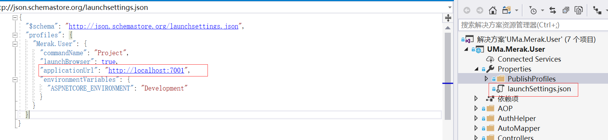

2.数据库配置
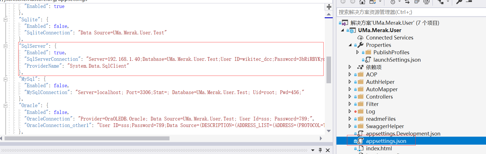

### 数据库初始化和升级
1.初始化数据库或者升级数据库，需要先确认数据库连接是否正确
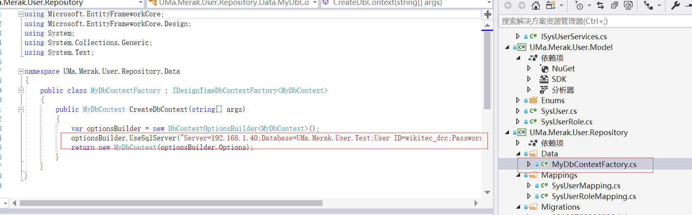

2.初始化数据库
```
将UMa.Merak.User.Repository 设置为启动项
点击程序包管理器控制台
输入：Add-Migration init执行
确认生成的文件，在执行：Update-Database init
```

`新添加的库要在MyDbContext中添加一个Mapping

3.升级数据库
```
Add-Migration 'UpdateModel' -Verbose
Update-Database 'UpdateModel' -Verbose

UpdateModel 名称需要和上次的不一样，上次为UpdateModel1，这次就需要命名为UpdateModel2
```


`每次升级的文件要保留，下次升级是根据当前文件来比较的`


### domain 实体类主键使用雪花算法生成19位long类型Id
使用时需要在dto中采用 strng类型，否则long容易在前台发生精度变化

### 发布项目
1.右键发布->选择发布目标（IIS,FTP等）->点击右下角创建配置文件
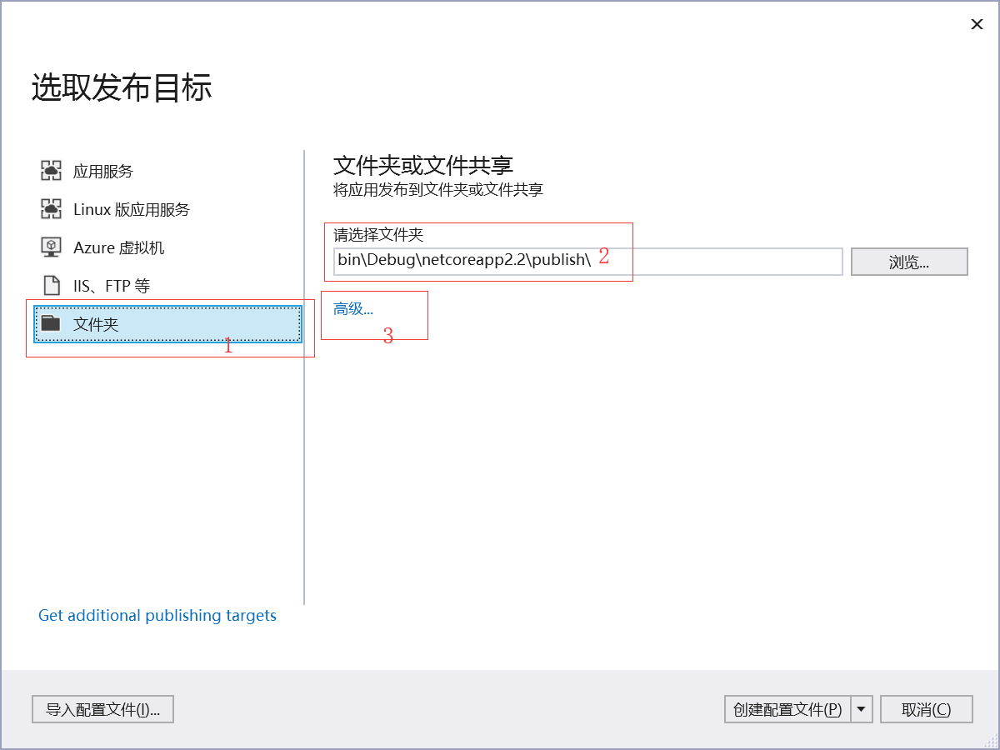
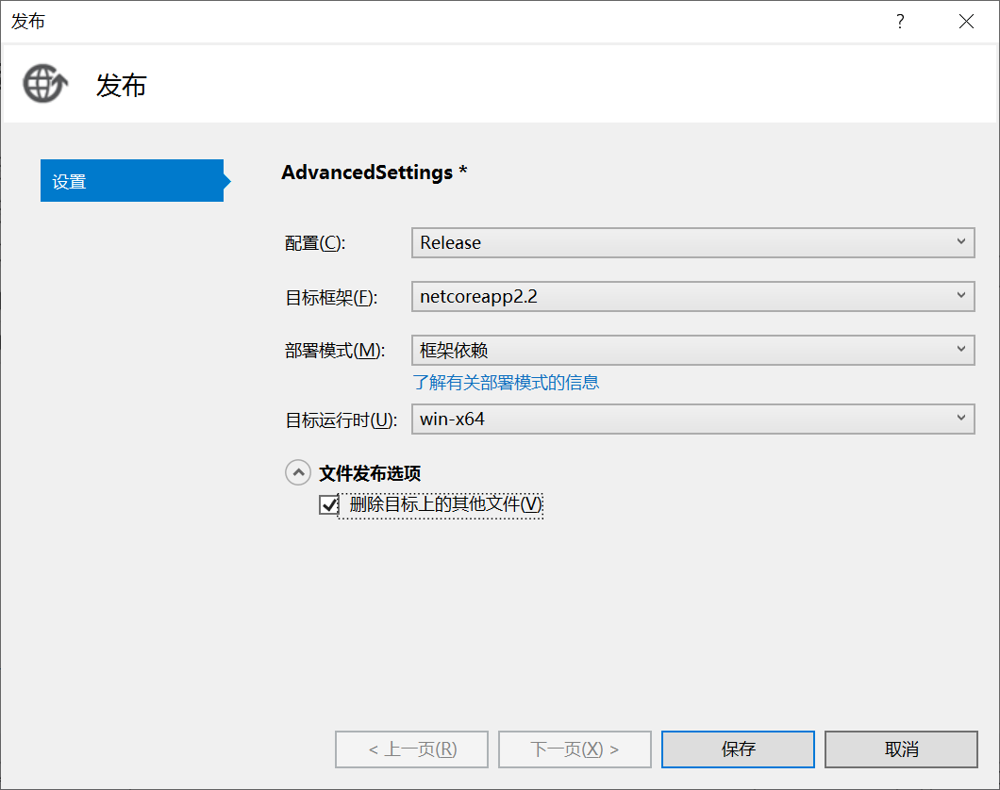

2.然后点击创建配置文件，再点发布就行了

3.如已配置过，这直接右键->点发布->发布
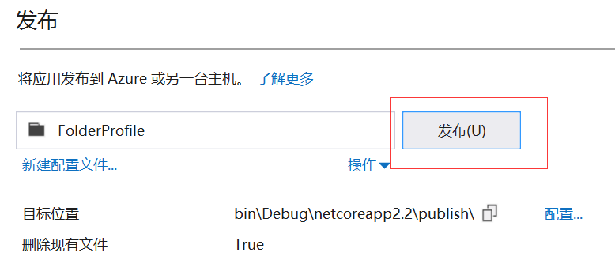

4.将发布后的文件全部拷贝到服务器部署项目的目录
本地发布目录（根据1中的配置找到该目录）
```
D:\workspace\gitcode\ZC.Customer\ZC.Customer\bin\Debug\netcoreapp2.2\publish
```
服务器部署目录
```
D:\www\uma_test\ZC.Customer.Test
```

### iis 部署
1.第一次需要安装.NET Core SDK和AspNetCoreModule托管模块（根据自己的版本下载）
根据本项目所以选择
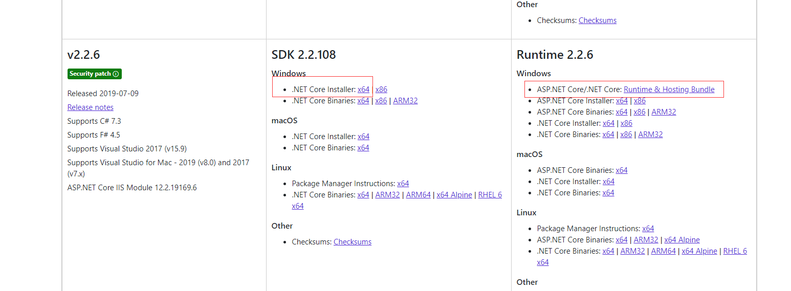

https://dotnet.microsoft.com/download/dotnet-core/2.2

2.配置iss程序网站，网站名称和端口号根据实际情况命名
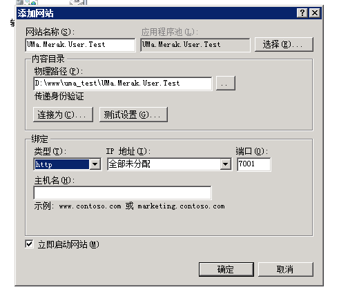

3.需要设置应用程序池 
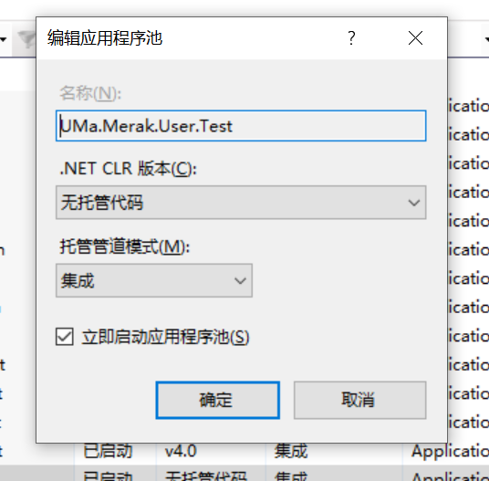

4.为了方便查看错误可以设置 web.config
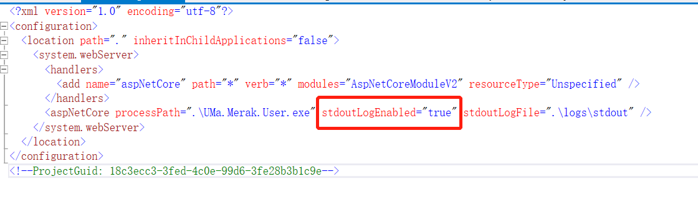

5.然后将本地项目这两个文件手动拷到服务器项目部署文件夹根目录中
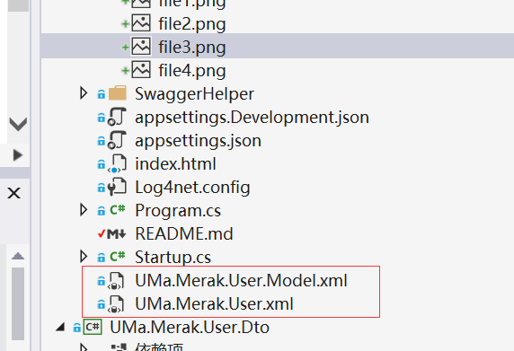
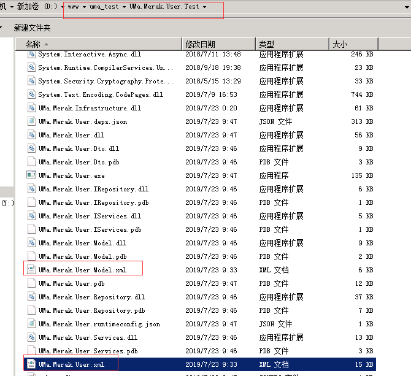

6.在服务器本地浏览器调用 http://localhost:7001/index.html 看是否成功

### 注意事项
⒈所有long类型的字段返回都要转成string类型.

### 上传文件限制大小
1.Startup.cs中设置文件上传的大小
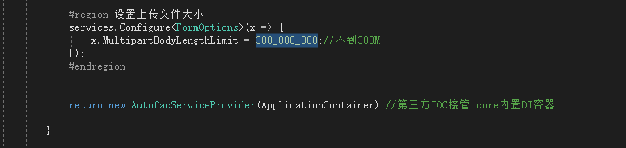
2.Controller接口信息添加[DisableRequestSizeLimit] 表明不限制上传文件的大小

### 访问本地资源上传的文件
1.在startup.cs中添加app.UseStaticFiles();
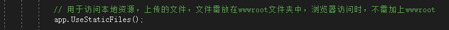

### 配置执诚生产环境
1.launchSettings.json 中修改applicationUrl地址为："applicationUrl": "http://*:4001",